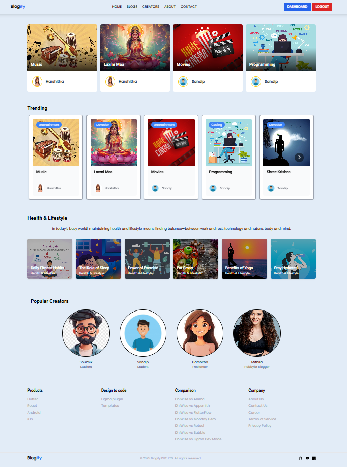
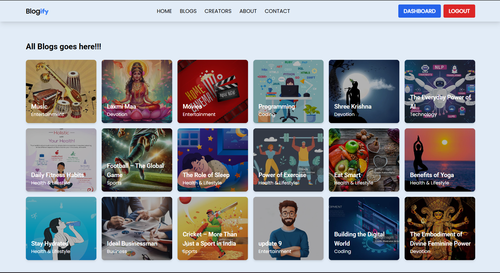
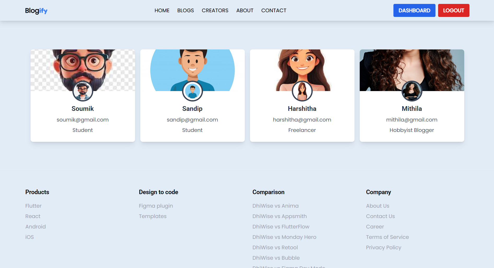
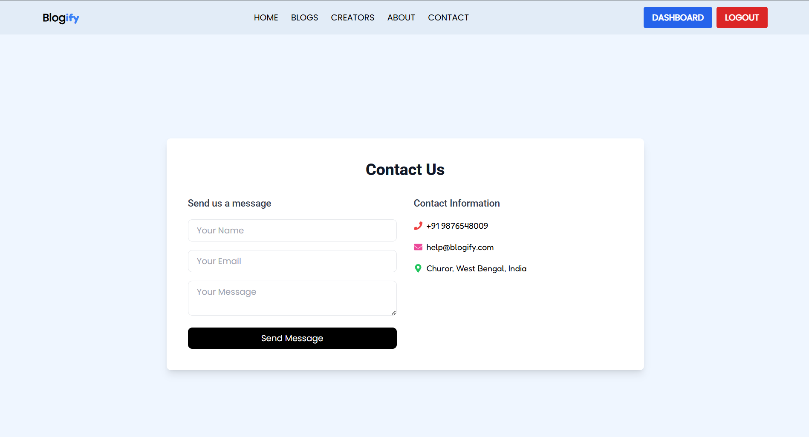
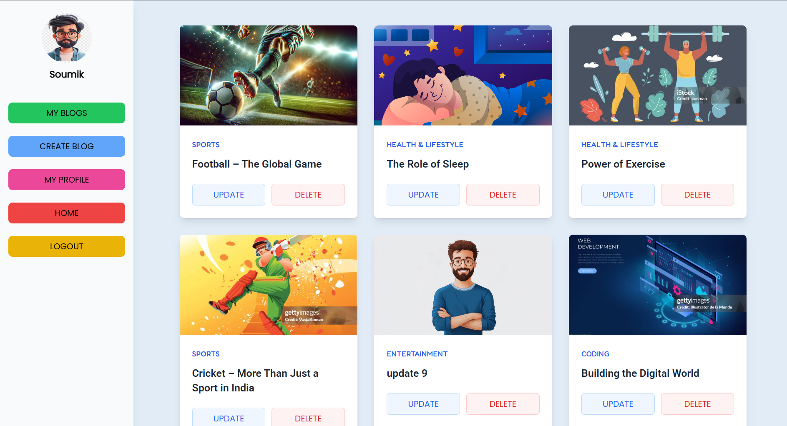

# 📰 MERN Blog App


---

## 📌 About the Project
The **MERN Blog App** is a full-stack blogging platform built using the MERN stack.  
It allows authenticated users to **create, edit, update, and delete blogs** with images stored on Cloudinary.  
This project demonstrates **authentication, CRUD operations, secure APIs, and modern UI design**.

---

## ✨ Features
- 🔐 **User Authentication** (JWT-based login & registration)  
- 📝 **Create, Edit, Delete Blogs**  
- 🖼️ **Image Upload with Cloudinary**  
- 👨‍💻 **Admin Dashboard** for managing blogs  
- 📱 **Responsive UI with TailwindCSS**  
- ⚡ **Optimized REST APIs with Express.js**  
- 📩 **Contact Form using Web3Forms**  
- 🔔 **Instant Notifications using React Hot Toast**  
- 🗂️ **Frontend & Backend are separated** for better scalability  
- 🚀 **Deployed with Render (Backend) & Vercel (Frontend)**    

---

## 🛠️ Technologies Used
- **Frontend:** React.js, TailwindCSS  
- **Backend:** Node.js, Express.js  
- **Database:** MongoDB (Mongoose ORM)  
- **Authentication:** JWT (JSON Web Token)  
- **Image Storage:** Cloudinary  
- **Form Handling:** Web3Forms  
- **Notifications:** React Hot Toast  
- **Other Tools:** Axios, React Router...

---

## ⚙️ Installation & Setup

### 🔹 Clone the repository
```bash
git clone https://github.com/sandip-pal1/Blogify-Blog-app-.git
cd Blogify-Blog-app-
```

### 🔹 Backend Setup
```bash
cd backend
npm install
# Create a .env file in /backend with:
# MONGO_URI=your_mongodb_url
# JWT_SECRET=your_secret
# CLOUDINARY_CLOUD_NAME=xxxx
# CLOUDINARY_API_KEY=xxxx
# CLOUDINARY_API_SECRET=xxxx
npm start
```

### 🔹 Frontend Setup
```bash
cd frontend
npm install
npm run dev
```

---

## 📷 Screenshots  

| Home Page | Blogs Page | Creators Page | Contact Detail | Dashboard |
|-----------|-------------|-----------|-------------|-------------|
|  |  |  |  |  |


---

## 🌍 Live Demo
👉 Try the App Here
- **👉 **: [Try the App Here](https://blogify-blog-app-phi.vercel.app/)  

## 👨‍💻 Author
**Sandip Pal**  
- 🔗 [GitHub](https://github.com/sandip-pal1)  
- 🔗 [LinkedIn](https://www.linkedin.com/in/sandip-pal-7877b9285/)  

---
